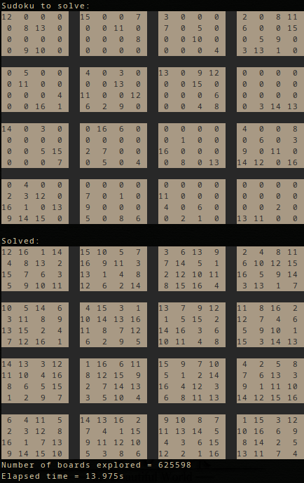

# Sudoku Solver

A sudoku solver for arbitrarily sized boards that uses constraint propagation, depth first search and bit representation of sets to find a solution.

## Set up
gcc -o sudoku sudoku.c

## Usage
./sudoku

Blocksize is the size of a block. This means that in a 9x9 board, blocks are 3x3, so blocksize is 3. 
The board is represented by numbers from 0 to board size where 0 means an empty space.

